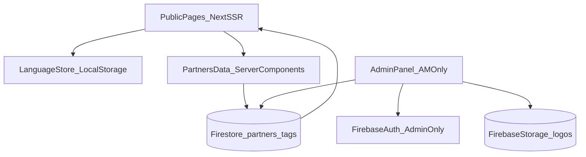

# ABC Website Creation Plan (Original)

This is the original project plan document created at the start of the project.

Note: some implementation details mention Firebase because that was the initial backend choice. The project later moved to Supabase.

---

# ABC Website + Admin Implementation Plan

## Scope and target stack

- Rebuild the current project as **Next.js App Router** for SSR-capable public pages and modern routing.
- Use **Tailwind CSS** for UI, animations, and responsive layout.
- Use **Firebase** for:
  - Firestore (partners + tags)
  - Storage (partner logos)
  - Auth (admin authentication)
- Keep admin credentials as requested: username `abc1111`, password `Ernestabc1111` (implemented securely via Firebase Auth + username mapping).

## Existing project transition

- Current project is Vite-based and minimal.
- Replace the Vite app structure with Next.js app structure while preserving branding intent/content.

## Planned app architecture

## Public website implementation

- Build and style these routes:
  - Landing
  - About
  - Partners list
  - Contact
  - Partner details (`/partner/[slug]`)
- Landing sections:
  - Navbar (logo, nav links, language dropdown with flag + short code)
  - Hero with requested text and mailto CTA (`mailto:info@abc1111.am`)
  - Who we are
  - Our mission
  - Why connect to ABC
  - Testimonials (animated)
  - Partners logo swiper (auto-moving)
  - Footer
- Visual design:
  - Primary blue, with Armenian-flag-inspired red/orange accents
  - IntersectionObserver-based reveal animations + motion polish

## Multilingual system (AM default, RU, EN)

- Create centralized translation dictionaries.
- Behavior:
  - Default language: Armenian
  - Language switch updates all public pages
  - Selected language persisted in `localStorage`
  - Admin panel remains Armenian-only (no language switch there)

## Partners directory behavior

- Partners list page:
  - Table/list with columns: logo, name, categories, email
  - Pagination
  - Default sorting: newest first (`createdAt desc`)
  - Search by name
  - Filter by category/tag
- Partner details page:
  - Dynamic route by slug (`/partner/[slug]`)
  - Full localized description and contact details
- Tags/categories:
  - Admin-added tags automatically become filter options on partners page

## Admin panel implementation

- Authentication:
  - Login flow using Firebase Auth
  - Username `abc1111` mapped to admin account and password `Ernestabc1111`
  - Route protection for `/admin`
- CRUD features:
  - Add / edit / delete partner
  - Upload partner logo to Storage
  - Localized fields per partner for AM/RU/EN:
    - name
    - description
  - Contact fields:
    - location (optional)
    - email (required)
    - phones (0..n)
  - Validation rules:
    - logo required
    - name required (all 3 locales)
    - description required (all 3 locales)
    - at least 1 tag required
    - email required

## Data model and backend glue

- Collections:
  - `partners`
  - `tags`
- Partner includes:
  - `slug`, `logoUrl`, `name.{am,ru,en}`, `description.{am,ru,en}`
  - `tags[]`, `email`, `location`, `phones[]`
  - timestamps (`createdAt`, `updatedAt`)

## Seed and content delivery

- Generate ~20 mock partner entries with realistic categories and contacts.
- Seed script and/or admin import utility to populate DB quickly.
- Provide polished placeholder content for all sections/pages (editable later).

## QA and acceptance checks

- Verify:
  - Public routes render and animate correctly
  - Language switching works globally and persists after reload
  - Partners filtering/search/pagination works
  - Dynamic partner pages open correctly by slug
  - Admin login works
  - CRUD updates appear immediately on public partners page
- Run lint/build checks and fix any introduced issues.

